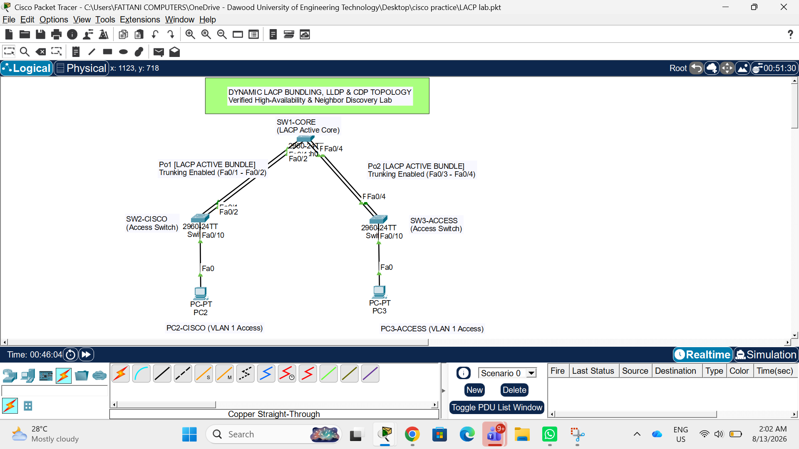
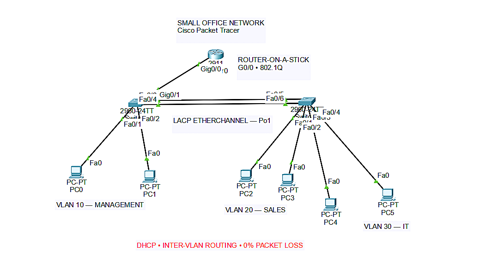
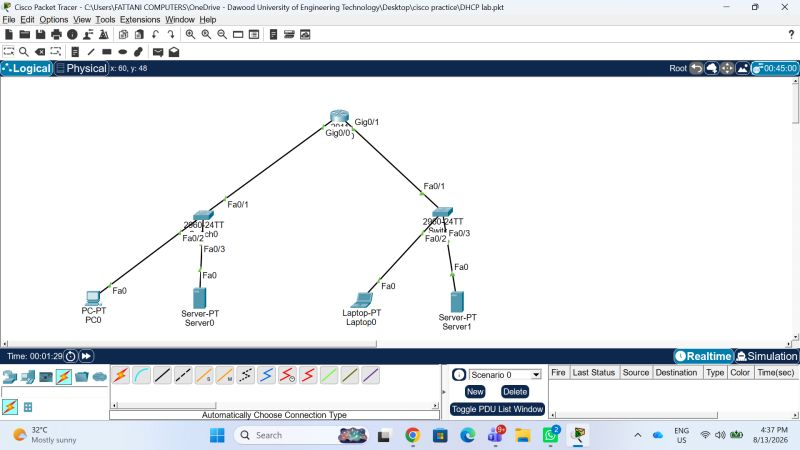
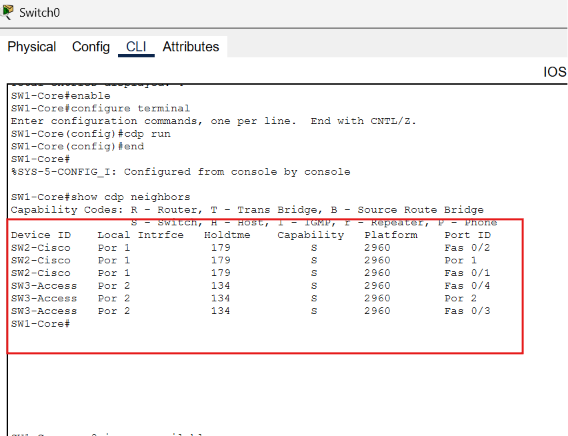
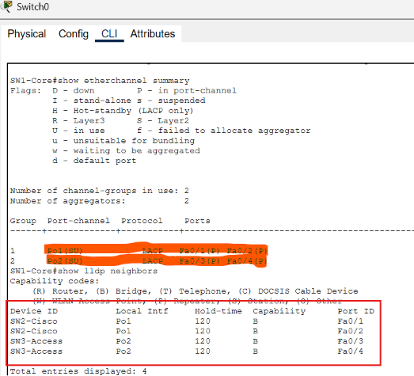
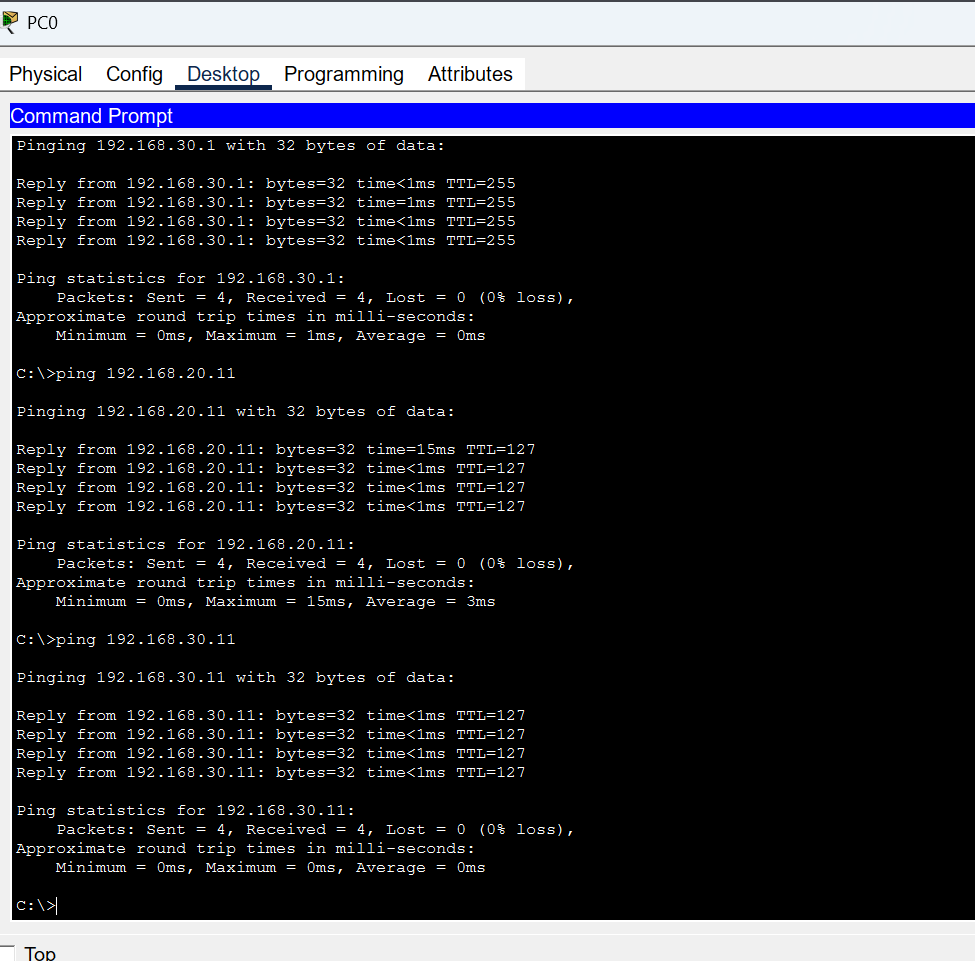
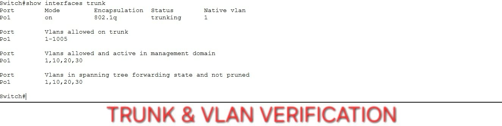
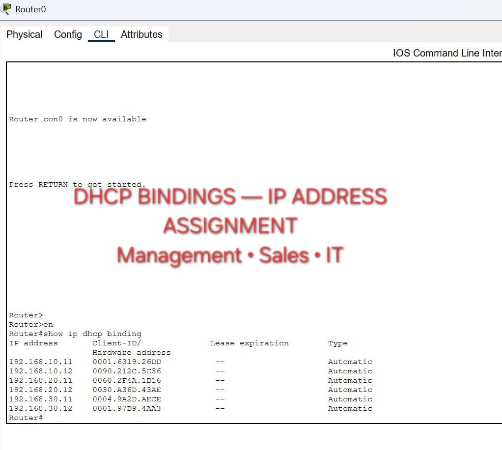
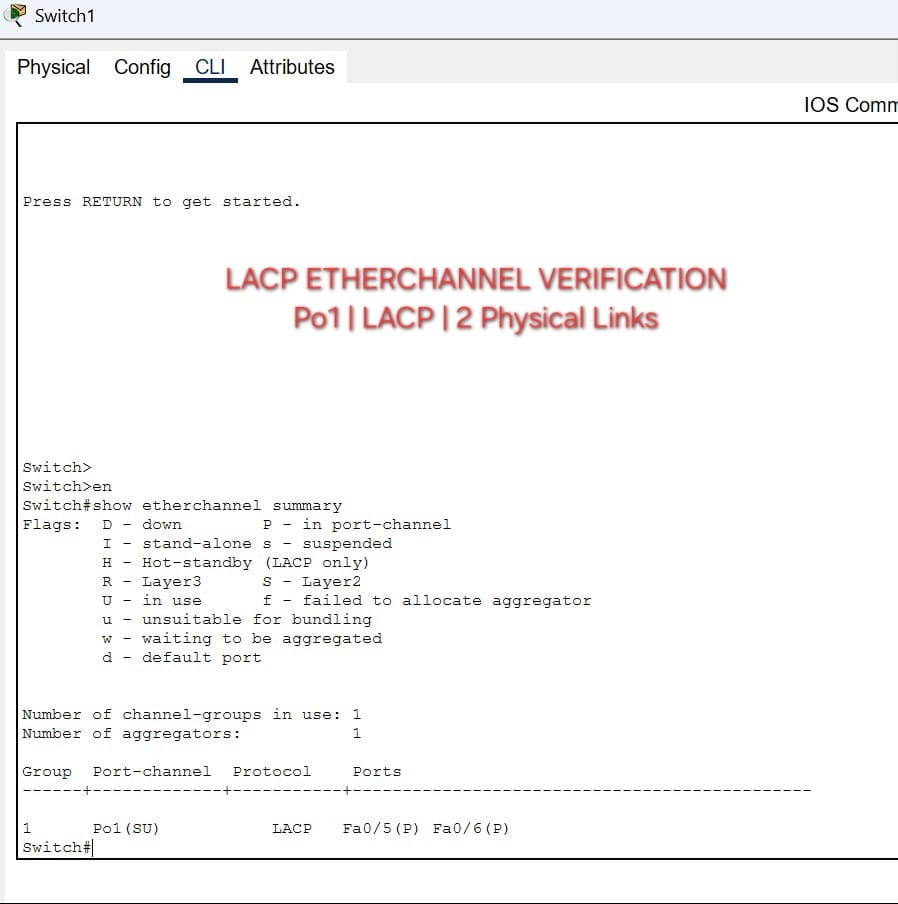

# ⚡ Cisco Networking Labs — Build. Break. Verify. Repeat.

<p align="center">
  <strong>🛡️ Cybersecurity Student • 🌐 Networking Enthusiast • 💻 Cisco IOS • 🔬 Packet Tracer</strong>
</p>

<p align="center">
  
  
  
  
  
  
</p>

<p align="center">
  <em>Not just commands. Not just diagrams.</em><br>
  <strong>Configure → Verify → Troubleshoot → Understand</strong>
</p>

---

## 🧭 Quick Navigation

**[📊 Lab Map](#-current-lab-map)** •
**[📌 Repository Overview](#-repository-overview--visual-proofs)** •
**[🏢 Enterprise Network](#-enterprise-dual-site-network)** •
**[🏢 Small Office Network](#-small-office-network)** •
**[📡 DHCP & DHCP Relay](#-dhcp--dhcp-relay)** •
**[🖼️ Visual Gallery](#-complete-visual-gallery)** •
**[🗂️ Structure](#️-repository-structure)** •
**[🛠️ CLI](#️-key-cli-configurations)** •
**[🔍 Verification](#-verification-workflow)** •
**[🧠 Concepts](#-concepts-practiced)** •
**[📈 Roadmap](#-learning-progression)**

---

# 🧠 What This Repository Is About

This is my **hands-on Cisco networking lab repository**, built while developing practical networking and cybersecurity skills.

Instead of only studying networking theory, I use **Cisco Packet Tracer** to build topologies, configure Cisco IOS devices, test connectivity, verify protocols, troubleshoot failures, and document the results.

The goal is simple:

> **Build the network → configure it → verify it → break it → troubleshoot it → understand why it works.**

---

## 🎯 Current Focus

- 🔀 **Switching & VLANs**
- 🔗 **Inter-VLAN Routing**
- ⚡ **EtherChannel & LACP**
- 🌳 **STP / RSTP**
- 🧩 **VLSM & IP Addressing**
- 🛣️ **RIPv2**
- 🧭 **OSPF**
- 🚀 **EIGRP**
- 📡 **DHCP**
- 🔁 **DHCP Relay**
- 🌐 **DNS**
- 🖥️ **HTTP Web Services**
- 🏢 **Small Office Network Design**
- 🏢 **Enterprise Dual-Site Network Design**
- 🔍 **Verification & Troubleshooting**

---

# 📊 Current Lab Map

| # | Area | Lab | Core Skills | Status |
|:-:|:-----|:----|:------------|:------:|
| 01 | 🔀 Switching | **VLAN & Trunking** | Segmentation, Access Ports, 802.1Q | ✅ |
| 02 | 🔗 Switching | **Inter-VLAN Routing** | Router-on-a-Stick, Sub-Interfaces | ✅ |
| 03 | ⚡ Switching | **EtherChannel + LACP** | Link Aggregation, Port-Channel | ✅ |
| 04 | 🌳 Switching | **STP / RSTP** | Loop Prevention, Redundancy | ✅ |
| 05 | 🧩 Subnetting | **VLSM** | Efficient IP Allocation | ✅ |
| 06 | 🛣️ Routing | **RIPv2** | Distance-Vector Routing | ✅ |
| 07 | 🧭 Routing | **OSPF** | Link-State, Area 0 | ✅ |
| 08 | 🚀 Routing | **EIGRP** | Dynamic Routing, Neighbors | ✅ |
| 09 | 📡 Network Services | **DHCP** | DHCP Pools, Dynamic IP Assignment | ✅ |
| 10 | 🔁 Network Services | **DHCP Relay** | DHCP Forwarding Across Networks | ✅ |
| 11 | 🏢 Networking | **Small Office Network** | VLANs, Trunking, DHCP, LACP, Inter-VLAN Routing | ✅ |
| 12 | 🏢 Enterprise | **Enterprise Dual-Site Network** | OSPF Area 0, DHCP Relay, DNS, A-Record, CNAME, HTTP | ✅ |

---

# 📌 Repository Overview & Visual Proofs

> ### 🔥 Visual proof matters.
>
> Each major lab includes its **topic, protocol/concept, topology preview, and direct lab/evidence location**.

| Category | Lab Topic | Protocol / Concept | Topology Preview | Lab Files & Visuals |
|:---------|:----------|:-------------------|:-----------------|:--------------------|
| **Switching** | Virtual Local Area Network | VLAN Segmentation & Trunking (802.1Q) |  | [📁 Lab File](./01-Switching/VLAN%20lab.pkt)<br>[🖼️ Screenshots](./01-Switching/VLAN%20images/) |
| **Switching** | Inter-VLAN Routing | Router-on-a-Stick, 802.1Q & VLAN Communication |  | [📁 Lab File](./01-Switching/Inter-VLAN%20Routing.pkt)<br>[🖼️ Screenshots](./01-Switching/inter%20VLAN%20images/) |
| **Switching** | EtherChannel with LACP | LACP, Link Aggregation & Port-Channel |  | [📁 Lab File](./01-Switching/EtherChannel-LACP/LACP%20lab.pkt)<br>[🖼️ Screenshots](./01-Switching/EtherChannel-LACP/) |
| **Switching** | STP / RSTP | Loop Prevention & Layer-2 Redundancy | 🌳 See dedicated section | [📁 Lab Folder](./01-Switching/STP-RSTP-Lab/) |
| **Switching** | **Small Office Network** | **VLANs, Trunking, DHCP, LACP & Inter-VLAN Routing** |  | [📁 Lab Folder](./01-Switching/Small-Office-Network/) |
| **Network Services** | **DHCP** | **Dynamic Host Configuration Protocol** |  | [📁 DHCP Lab](./Services/DHCP%20lab.pkt)<br>[🖼️ Evidence](./Services/DHCP.jpg) |
| **Network Services** | **DHCP Relay** | **DHCP Forwarding Across Networks** |  | [📁 DHCP Relay Lab](./Services/DHCP%20relay%20lab.pkt)<br>[🖼️ Evidence](./Services/DHCP%20relay.jpg) |
| **Subnetting** | Variable Length Subnet Masking | VLSM & IP Address Allocation |  | [📁 Lab File](./02-Subnetting/VLSM%20lab.pkt)<br>[🖼️ Screenshots](./02-Subnetting/VLSM%20images/) |
| **Routing** | Routing Information Protocol | RIPv2 Distance Vector |  | [📁 Lab File](./03-Routing/RIP%20Lab.pkt)<br>[🖼️ Screenshots](./03-Routing/RIP%20images/) |
| **Routing** | Open Shortest Path First | OSPF Single-Area Link-State |  | [📁 Lab File](./03-Routing/ospf%20lab.pkt)<br>[🖼️ Screenshots](./03-Routing/OSPF%20images/) |
| **Routing** | Enhanced Interior Gateway Routing Protocol | EIGRP / Multi-Router Setup |  | [📁 Lab File](./03-Routing/dynamic%20routing.pkt)<br>[🖼️ Screenshots](./03-Routing/EIGRP%20images/) |
| **Enterprise** | **Enterprise Dual-Site Network — Lab #12** | **OSPF Area 0, DHCP Relay, DNS, A-Record, CNAME & HTTP** |  | [📁 DNS LAB.pkt](./Services/Enterprise-DNS-DHCP-Relay-OSPF/DNS%20LAB.pkt)<br>[🖼️ Screenshot 2404](./Services/Enterprise-DNS-DHCP-Relay-OSPF/Screenshot%20%282404%29.png)<br>[🖼️ Screenshot 2405](./Services/Enterprise-DNS-DHCP-Relay-OSPF/Screenshot%20%282405%29.png)<br>[🖼️ Screenshot 2406](./Services/Enterprise-DNS-DHCP-Relay-OSPF/Screenshot%20%282406%29.png)<br>[🖼️ Screenshot 2407](./Services/Enterprise-DNS-DHCP-Relay-OSPF/Screenshot%20%282407%29.png) |

---

# 🗂️ Repository Structure

```text
Cisco-Networking-Labs/
│
├── 📄 README.md
│
├── 🔀 01-Switching/
│   │
│   ├── 📦 VLAN lab.pkt
│   ├── 📁 VLAN images/
│   │   └── 🖼️ vlan 1.png
│   │
│   ├── 📦 Inter-VLAN Routing.pkt
│   ├── 📁 inter VLAN images/
│   │   ├── 🖼️ inter vlan 1.png
│   │   └── 🖼️ inter vlan 2.png
│   │
│   ├── 📁 EtherChannel-LACP/
│   │   ├── 📦 LACP lab.pkt
│   │   ├── 🖼️ lacp1.png
│   │   ├── 🖼️ lacp2.png
│   │   └── 🖼️ lacp3.png
│   │
│   ├── 📁 STP-RSTP-Lab/
│   │   ├── 📦 STP LAB
│   │   ├── 🖼️ STP AND RSTP 1
│   │   ├── 🖼️ STP AND RSTP 2
│   │   ├── 🖼️ STP AND RSTP 3
│   │   ├── 🖼️ STP AND RSTP 4
│   │   ├── 🖼️ STP AND RSTP 5
│   │   └── 🖼️ STP VS RSTP
│   │
│   └── 🏢 Small-Office-Network/
│       ├── 🖼️ image1.png
│       ├── 🖼️ image2.png
│       ├── 🖼️ image3.jpeg
│       ├── 🖼️ image4.jpeg
│       └── 🖼️ image5.jpeg
│
├── 📡 Services/
│   ├── 📦 DHCP lab.pkt
│   ├── 📦 DHCP relay lab.pkt
│   ├── 🖼️ DHCP.jpg
│   ├── 🖼️ DHCP relay.jpg
│   │
│   └── 🏢 Enterprise-DNS-DHCP-Relay-OSPF/
│       ├── 📦 DNS LAB.pkt
│       ├── 🖼️ Screenshot (2404).png
│       ├── 🖼️ Screenshot (2405).png
│       ├── 🖼️ Screenshot (2406).png
│       └── 🖼️ Screenshot (2407).png
│
├── 🧩 02-Subnetting/
│   ├── 📦 VLSM lab.pkt
│   └── 📁 VLSM images/
│
└── 🛣️ 03-Routing/
    ├── 📦 RIP Lab.pkt
    ├── 📦 ospf lab.pkt
    ├── 📦 dynamic routing.pkt
    ├── 📁 RIP images/
    ├── 📁 OSPF images/
    └── 📁 EIGRP images/
````

---

# 🔥 Proof of Work

Every major lab is backed by a **Packet Tracer topology and visual verification** where available.

The repository is designed around a simple principle:

```text
Configuration
     ↓
Verification
     ↓
Traffic Testing
     ↓
Troubleshooting
     ↓
Documented Evidence
```

---

# ⚡ EtherChannel + LACP

<p align="center">
  
  
  
</p>

**Focus:** Link aggregation, LACP negotiation, Port-Channel formation and verification.

---

# 🏢 Enterprise Dual-Site Network

> **Lab #12 — Enterprise DNS, DHCP Relay & OSPF Integration**

This lab combines multiple networking concepts into a single **enterprise-style dual-site network**.

The topology demonstrates how routing, centralized DHCP, DHCP Relay, DNS resolution and an HTTP web service can work together across different network segments.

---

## 🎯 Lab Objectives

* Configure **OSPF Single Area / Area 0**
* Configure **DHCP Relay**
* Forward DHCP requests using `ip helper-address 192.168.20.2`
* Configure a centralized DHCP service
* Configure DNS **A-Record**
* Configure DNS **CNAME**
* Host an HTTP Web Portal
* Resolve `portal.enterprise.com`
* Resolve `www.enterprise.com`
* Verify end-to-end connectivity between network sites
* Verify dynamic IP lease assignment
* Verify DNS name resolution
* Access the enterprise web portal through a browser

---

## 🌐 Domain Setup

| Domain                  | Record Type  | Destination             |
| :---------------------- | :----------- | :---------------------- |
| `portal.enterprise.com` | **A-Record** | `192.168.20.2`          |
| `www.enterprise.com`    | **CNAME**    | `portal.enterprise.com` |

The DNS configuration demonstrates the difference between a direct **A-Record** and an alias created using a **CNAME** record.

---

## 📡 DHCP Relay

The remote client network uses DHCP Relay to forward DHCP requests toward the centralized DHCP server.

```bash
ip helper-address 192.168.20.2
```

This allows DHCP clients on a different routed network to obtain their IP configuration from the DHCP server at `192.168.20.2`.

---

## 🧭 OSPF Area 0

The enterprise topology uses **OSPF Area 0** for dynamic routing between the sites.

```text
Enterprise Site A
       │
       │
       │ OSPF Area 0
       │
       ▼
   Routed Network
       │
       │
       ▼
Enterprise Site B
       │
       ├── DHCP Server
       ├── DNS Server
       └── HTTP Web Portal
```

---

## 🔄 Enterprise Network Flow

```text
DHCP Client
     │
     │ DHCP Broadcast
     ▼
Router / DHCP Relay
     │
     │ ip helper-address
     ▼
DHCP Server
192.168.20.2
     │
     │ IP Lease
     ▼
DHCP Client
     │
     │ DNS Query
     ▼
DNS Server
     │
     ├── portal.enterprise.com
     │       ↓
     │   192.168.20.2
     │
     └── www.enterprise.com
             ↓
       portal.enterprise.com
             ↓
          192.168.20.2
             │
             ▼
       HTTP Web Portal
```

---

## 📦 Enterprise Dual-Site Lab Files

**Folder:**

`./Services/Enterprise-DNS-DHCP-Relay-OSPF/`

**Packet Tracer File:**

[📁 DNS LAB.pkt](./Services/Enterprise-DNS-DHCP-Relay-OSPF/DNS%20LAB.pkt)

---

# 🖼️ Enterprise Dual-Site Visual Proofs

## 1️⃣ Web Browser Access

<p align="center">
  
</p>

**Evidence:** HTTP Web Portal successfully accessed through the enterprise domain.

---

## 2️⃣ CLI Ping & Dynamic IP Lease Verification

<p align="center">
  
</p>

**Evidence:** CLI connectivity testing and dynamically assigned IP address verification.

---

## 3️⃣ DNS Server Configuration — A-Record & CNAME

<p align="center">
  
</p>

**Evidence:** DNS records configured for the enterprise web portal.

```text
portal.enterprise.com
        │
        └── A-Record → 192.168.20.2

www.enterprise.com
        │
        └── CNAME → portal.enterprise.com
```

---

## 4️⃣ Annotated Topology View

<p align="center">
  
</p>

**Evidence:** Annotated Packet Tracer topology showing the enterprise dual-site architecture.

---

## 🔍 Enterprise Dual-Site Verification Checklist

| Component    | Verification                                 | Result |
| :----------- | :------------------------------------------- | :----: |
| OSPF         | Area 0 routing operation                     |    ✅   |
| DHCP         | Dynamic IP assignment                        |    ✅   |
| DHCP Relay   | `ip helper-address 192.168.20.2`             |    ✅   |
| DNS A-Record | `portal.enterprise.com → 192.168.20.2`       |    ✅   |
| DNS CNAME    | `www.enterprise.com → portal.enterprise.com` |    ✅   |
| HTTP         | Web portal access                            |    ✅   |
| Ping         | End-to-end connectivity                      |    ✅   |
| Topology     | Dual-site architecture documented            |    ✅   |

> **Lab #12 brings routing and network services together into one enterprise-style topology, demonstrating how DHCP, DNS, HTTP and OSPF operate as interconnected services rather than isolated configurations.**

---

# 📡 DHCP & DHCP Relay

> **A dedicated Network Services section covering dynamic IP addressing and DHCP forwarding across routed networks.**

DHCP is a core network service used to automatically provide clients with network configuration instead of requiring every device to be configured manually.

This repository includes separate Packet Tracer labs for:

* 📡 **DHCP**
* 🔁 **DHCP Relay**
* 🏢 **Enterprise DHCP Relay Integration**

---

## 📡 DHCP Lab

### 🎯 Objectives

* Configure a DHCP service
* Create a DHCP address pool
* Define the network available to clients
* Configure the default gateway
* Configure DNS information
* Allow clients to obtain IP addresses dynamically
* Verify DHCP assignments
* Understand the client → DHCP server process

### 📦 Lab Files

**Packet Tracer Lab:** [📁 DHCP lab.pkt](./Services/DHCP%20lab.pkt)

**Visual Evidence:** [🖼️ DHCP.jpg](./Services/DHCP.jpg)

### 🖼️ DHCP Lab Evidence

<p align="center">
  
</p>

**Result:** DHCP configuration and dynamic client addressing are documented through the accompanying Packet Tracer evidence.

---

# 🔁 DHCP Relay Lab

### 🎯 Objectives

* Understand DHCP operation across different networks
* Configure DHCP relay functionality
* Forward DHCP requests toward a DHCP server
* Understand why DHCP Relay is required when the DHCP server is not located on the same broadcast network
* Verify successful client address assignment

### 📦 Lab Files

**Packet Tracer Lab:** [📁 DHCP Relay lab.pkt](./Services/DHCP%20relay%20lab.pkt)

**Visual Evidence:** [🖼️ DHCP relay.jpg](./Services/DHCP%20relay.jpg)

### 🖼️ DHCP Relay Evidence

<p align="center">
  
</p>

**Result:** DHCP requests are demonstrated being forwarded between networks through DHCP relay functionality.

---

## 🧠 DHCP vs DHCP Relay

| Feature                             | DHCP                    | DHCP Relay              |
| :---------------------------------- | :---------------------- | :---------------------- |
| Primary Purpose                     | Assign IP configuration | Forward DHCP requests   |
| Client Addressing                   | Dynamic                 | Dynamic                 |
| Works Within Local Broadcast Domain | ✅                       | ✅                       |
| Helps Across Routed Networks        | Limited                 | ✅                       |
| Requires DHCP Pool                  | ✅                       | Depends on DHCP server  |
| Common Cisco Command                | `ip dhcp pool`          | `ip helper-address`     |
| Main Concept                        | Address Assignment      | DHCP Request Forwarding |

---

## 🔄 DHCP Communication Concept

```text
                    DHCP
                     │
                     ▼
             ┌───────────────┐
             │ DHCP Server   │
             └───────┬───────┘
                     │
              IP Address Pool
                     │
                     ▼
             ┌───────────────┐
             │    Network    │
             └───────┬───────┘
                     │
                     ▼
               💻 DHCP Client
```

---

## 🔁 DHCP Relay Concept

```text
      DHCP Client
           │
           │ DHCP Broadcast
           ▼
    ┌──────────────┐
    │    Router    │
    │ DHCP Relay   │
    └──────┬───────┘
           │
           │ DHCP Forwarding
           ▼
    ┌──────────────┐
    │ DHCP Server  │
    └──────┬───────┘
           │
           │ IP Configuration
           ▼
      DHCP Client
```

> **Key concept:** DHCP clients initially use broadcast communication. A router does not normally forward broadcasts between different networks, so DHCP Relay allows the router to forward the request toward a DHCP server.

---

# 🏢 Small Office Network

> **A practical end-to-end switching and routing lab combining multiple Cisco networking concepts into one small office scenario.**

This lab brings together concepts practiced separately in earlier labs and verifies that they work together as one network.

---

## 🎯 Lab Objectives

* Create logical network segmentation using **VLANs**
* Configure **trunk links**
* Configure **LACP EtherChannel**
* Configure **DHCP**
* Enable **Inter-VLAN Routing**
* Verify DHCP assignments using **DHCP bindings**
* Verify trunk and VLAN operation
* Test end-to-end connectivity using **ping**
* Confirm successful communication with **0% packet loss**

---

## 🧩 Technologies / Concepts Used

| Technology                 | Purpose                                              |
| :------------------------- | :--------------------------------------------------- |
| **VLAN**                   | Logically separates departments/devices              |
| **802.1Q Trunking**        | Carries multiple VLANs across a link                 |
| **LACP EtherChannel**      | Bundles physical links into one logical Port-Channel |
| **DHCP**                   | Automatically provides IP configuration to clients   |
| **Inter-VLAN Routing**     | Allows communication between different VLANs         |
| **Ping**                   | Verifies end-to-end connectivity                     |
| **Cisco IOS Verification** | Confirms actual device state and operation           |

---

## 🏗️ Network Flow

```text
                    ┌──────────────────────┐
                    │    Small Office      │
                    │       Network        │
                    └──────────┬───────────┘
                               │
                         VLAN / Trunking
                               │
                    ┌──────────▼───────────┐
                    │   Routing / DHCP     │
                    │      Services        │
                    └──────────┬───────────┘
                               │
                 ┌─────────────┴─────────────┐
                 │                           │
           VLAN Segmentation           DHCP Assignment
                 │                           │
                 └─────────────┬─────────────┘
                               │
                         End-to-End Test
                               │
                         ✅ 0% Packet Loss
```

---

# 🔍 Small Office Verification Evidence

|    Image   | Evidence                     | What It Demonstrates                            |
| :--------: | :--------------------------- | :---------------------------------------------- |
| **image1** | 📡 Inter-VLAN Ping           | Successful connectivity with **0% packet loss** |
| **image2** | 🏢 Network Topology          | Complete Small Office Network topology          |
| **image3** | 🔀 VLAN & Trunk Verification | VLAN membership and trunk operation             |
| **image4** | 📡 DHCP Bindings             | Dynamically assigned client addresses           |
| **image5** | ⚡ LACP EtherChannel          | Successful EtherChannel / LACP verification     |

---

## 🧠 What the Verification Proves

```text
VLAN Configuration
       ↓
Trunk Verification
       ↓
LACP EtherChannel
       ↓
DHCP Address Assignment
       ↓
Inter-VLAN Communication
       ↓
Ping Verification
       ↓
✅ Successful Network Operation
```

---

# 🖼️ Small Office Network — Visual Evidence

## 1️⃣ Inter-VLAN Ping — 0% Packet Loss

<p align="center">
  
</p>

**Result:** Successful end-to-end connectivity verification.

---

## 2️⃣ Small Office Network Topology

<p align="center">
  
</p>

**Result:** Complete Packet Tracer topology showing the network design and connected devices.

---

## 3️⃣ VLAN & Trunk Verification

<p align="center">
  
</p>

**Result:** VLAN and trunk configuration verified through Cisco IOS output.

---

## 4️⃣ DHCP Bindings

<p align="center">
  
</p>

**Result:** DHCP bindings confirm that clients received dynamically assigned addressing.

---

## 5️⃣ LACP EtherChannel Verification

<p align="center">
  
</p>

**Result:** LACP EtherChannel operation verified through Cisco IOS.

---

## 🧪 Small Office Verification Checklist

| Check              | Verification                    | Result |
| :----------------- | :------------------------------ | :----: |
| VLANs              | VLAN membership verified        |    ✅   |
| Trunk              | Trunk operation verified        |    ✅   |
| EtherChannel       | LACP / Port-Channel verified    |    ✅   |
| DHCP               | Client bindings verified        |    ✅   |
| Inter-VLAN Routing | Cross-VLAN communication tested |    ✅   |
| Connectivity       | Ping test completed             |    ✅   |
| Packet Loss        | End-to-end test                 | **0%** |

> **The goal was not simply to configure the devices. The goal was to configure the network, verify each layer, and then prove that the complete network actually works.**

---

# 🖼️ Complete Visual Gallery

The repository includes visual evidence for the major labs so that the topology, configuration and verification results can be reviewed without digging through every folder.

---

## 🔀 VLAN & Trunking

<p align="center">
  
</p>

**Lab:** [📁 VLAN Lab](./01-Switching/VLAN%20lab.pkt) · [🖼️ All VLAN Screenshots](./01-Switching/VLAN%20images/)

---

## 🔗 Inter-VLAN Routing

<p align="center">
  
  
</p>

**Lab:** [📁 Inter-VLAN Lab](./01-Switching/Inter-VLAN%20Routing.pkt) · [🖼️ All Inter-VLAN Screenshots](./01-Switching/inter%20VLAN%20images/)

---

## ⚡ EtherChannel + LACP

<p align="center">
  
  
  
</p>

**Lab:** [📁 LACP Packet Tracer Lab](./01-Switching/EtherChannel-LACP/LACP%20lab.pkt) · [🖼️ LACP Evidence](./01-Switching/EtherChannel-LACP/)

---

## 📡 DHCP

<p align="center">
  
</p>

**Lab:** [📁 DHCP Packet Tracer Lab](./Services/DHCP%20lab.pkt) · [🖼️ DHCP Evidence](./Services/DHCP.jpg)

**Focus:** DHCP pools, dynamic IP assignment, default gateway, DNS configuration and verification.

---

## 🔁 DHCP Relay

<p align="center">
  
</p>

**Lab:** [📁 DHCP Relay Packet Tracer Lab](./Services/DHCP%20relay%20lab.pkt) · [🖼️ DHCP Relay Evidence](./Services/DHCP%20relay.jpg)

**Focus:** DHCP request forwarding across routed networks using DHCP Relay functionality.

---

## 🏢 Enterprise Dual-Site Network

<p align="center">
  
</p>

### Web Browser Access

<p align="center">
  
</p>

### CLI Ping & Dynamic IP Lease Verification

<p align="center">
  
</p>

### DNS Server — A-Record & CNAME

<p align="center">
  
</p>

### Annotated Topology

<p align="center">
  
</p>

**Lab:** [📁 DNS LAB.pkt](./Services/Enterprise-DNS-DHCP-Relay-OSPF/DNS%20LAB.pkt)

**Core Protocols:** OSPF Area 0 • DHCP Relay • DNS • HTTP

**DHCP Relay:**

```text
ip helper-address 192.168.20.2
```

**DNS:**

```text
portal.enterprise.com → A-Record → 192.168.20.2
www.enterprise.com    → CNAME   → portal.enterprise.com
```

---

## 🏢 Small Office Network

<p align="center">
  
</p>

<p align="center">
  
  
</p>

<p align="center">
  
  
</p>

**Lab:** [📁 Small Office Network](./01-Switching/Small-Office-Network/)

**Evidence included:** topology, VLAN/trunk verification, DHCP bindings, LACP EtherChannel verification, and successful Inter-VLAN connectivity.

---

## 🌳 STP / RSTP

<p align="center">
  <strong>STP/RSTP visual evidence is stored in the dedicated lab folder.</strong>
</p>

**Lab folder:** [📁 STP-RSTP-Lab](./01-Switching/STP-RSTP-Lab/)

Includes the Packet Tracer lab, supporting screenshots, and the **STP VS RSTP** comparison visual.

---

## 🧩 VLSM & IP Address Allocation

<p align="center">
  
</p>

**Lab:** [📁 VLSM Lab](./02-Subnetting/VLSM%20lab.pkt) · [🖼️ VLSM Screenshots](./02-Subnetting/VLSM%20images/)

---

## 🛣️ RIPv2

<p align="center">
  
</p>

**Lab:** [📁 RIPv2 Lab](./03-Routing/RIP%20Lab.pkt) · [🖼️ RIP Evidence](./03-Routing/RIP%20images/)

---

## 🧭 OSPF

<p align="center">
  
</p>

**Lab:** [📁 OSPF Lab](./03-Routing/ospf%20lab.pkt) · [🖼️ OSPF Evidence](./03-Routing/OSPF%20images/)

---

## 🚀 EIGRP

<p align="center">
  
</p>

**Lab:** [📁 EIGRP / Dynamic Routing Lab](./03-Routing/dynamic%20routing.pkt) · [🖼️ EIGRP Evidence](./03-Routing/EIGRP%20images/)

---

# 🌳 STP / RSTP

The STP/RSTP lab is part of the **Switching** section.

### 📁 Lab

`01-Switching/STP-RSTP-Lab/`

### 🧠 Core Concepts

* Spanning Tree Protocol
* Rapid Spanning Tree Protocol
* Root Bridge
* Port Roles / States
* Layer-2 Loop Prevention
* Redundancy
* Faster convergence with RSTP

### 🔍 Verification

```bash
Switch# show spanning-tree
Switch# show spanning-tree summary
Switch# show interfaces status
```

---

# 🛠️ Key CLI Configurations

## 1. VLAN & Trunking

```bash
Switch# configure terminal

Switch(config)# vlan 10
Switch(config-vlan)# name IT_Dept
Switch(config-vlan)# exit

Switch(config)# interface FastEthernet 0/1
Switch(config-if)# switchport mode access
Switch(config-if)# switchport access vlan 10

Switch(config)# interface GigabitEthernet 0/1
Switch(config-if)# switchport mode trunk
```

### Verify

```bash
Switch# show vlan brief
Switch# show interfaces trunk
```

---

## 2. Inter-VLAN Routing — Router-on-a-Stick

```bash
Router# configure terminal

Router(config)# interface GigabitEthernet 0/0.10
Router(config-subif)# encapsulation dot1Q 10
Router(config-subif)# ip address 192.168.1.1 255.255.255.0

Router(config)# interface GigabitEthernet 0/0.20
Router(config-subif)# encapsulation dot1Q 20
Router(config-subif)# ip address 192.168.2.1 255.255.255.0
```

### Verify

```bash
Router# show ip interface brief
Router# show ip route
PC> ping <destination-ip>
```

---

## 3. EtherChannel with LACP

```bash
Switch# configure terminal

Switch(config)# interface range FastEthernet 0/1 - 2
Switch(config-if-range)# channel-group 1 mode active
Switch(config-if-range)# exit

Switch(config)# interface Port-channel 1
Switch(config-if)# switchport mode trunk
```

### Verify

```bash
Switch# show etherchannel summary
Switch# show interfaces port-channel 1
Switch# show lacp neighbor
Switch# show interfaces status
```

---

## 4. DHCP

DHCP (**Dynamic Host Configuration Protocol**) automatically provides clients with network configuration such as:

* IP address
* Subnet mask
* Default gateway
* DNS information

### Example Cisco IOS DHCP Configuration

```bash
Router# configure terminal

Router(config)# ip dhcp excluded-address 192.168.10.1 192.168.10.10

Router(config)# ip dhcp pool OFFICE_VLAN10
Router(dhcp-config)# network 192.168.10.0 255.255.255.0
Router(dhcp-config)# default-router 192.168.10.1
Router(dhcp-config)# dns-server 8.8.8.8
```

### Verify

```bash
Router# show ip dhcp binding
Router# show ip dhcp pool
```

> **Note:** The exact DHCP network, gateway and VLAN values depend on the topology used in the individual lab.

---

## 5. DHCP Relay

DHCP Relay allows DHCP requests to reach a DHCP server when the server and client are located on different IP networks.

### Enterprise Dual-Site Configuration

```bash
Router# configure terminal

Router(config)# interface GigabitEthernet 0/0
Router(config-if)# ip helper-address 192.168.20.2
```

The `ip helper-address` command tells the router where to forward DHCP requests.

### Verify

```bash
Router# show ip interface brief
Router# show running-config
Router# show ip route
```

### DHCP Relay Flow

```text
DHCP Client
     │
     │ Broadcast Request
     ▼
Router / DHCP Relay
     │
     │ Forwarded Request
     ▼
DHCP Server
192.168.20.2
     │
     │ DHCP Offer
     ▼
Router / DHCP Relay
     │
     ▼
DHCP Client
```

---

## 6. DNS — A-Record & CNAME

DNS (**Domain Name System**) translates human-readable domain names into network addresses.

### Enterprise DNS Records

```text
portal.enterprise.com
        │
        └── A-Record → 192.168.20.2

www.enterprise.com
        │
        └── CNAME → portal.enterprise.com
```

### Purpose

* **A-Record:** Directly maps `portal.enterprise.com` to `192.168.20.2`.
* **CNAME:** Creates `www.enterprise.com` as an alias of `portal.enterprise.com`.

This allows users to access the same HTTP web portal using either enterprise domain name.

---

## 7. HTTP Web Portal

The Enterprise Dual-Site lab includes an HTTP Web Portal hosted at:

```text
portal.enterprise.com
```

The portal is accessed through DNS name resolution rather than requiring the client to enter the server IP directly.

```text
Client
  │
  │ DNS Query
  ▼
DNS Server
  │
  │ portal.enterprise.com
  ▼
192.168.20.2
  │
  ▼
HTTP Web Portal
```

---

## 8. Small Office Network — Combined Verification

The Small Office Network combines several concepts into one practical workflow:

```text
VLAN Creation
      ↓
Access Port Assignment
      ↓
Trunk Configuration
      ↓
LACP EtherChannel
      ↓
DHCP Address Assignment
      ↓
Inter-VLAN Routing
      ↓
Connectivity Testing
      ↓
Verification Evidence
```

### Useful Verification Commands

```bash
Switch# show vlan brief
Switch# show interfaces trunk
Switch# show etherchannel summary
Switch# show lacp neighbor

Router# show ip interface brief
Router# show ip route
Router# show ip dhcp binding

PC> ipconfig
PC> ping <destination-ip>
```

---

## 9. VLSM & IP Address Allocation

VLSM (**Variable Length Subnet Masking**) allows different subnet sizes to be used according to host requirements.

```bash
Router# show ip interface brief
Router# show ip route
```

---

## 10. RIPv2 Dynamic Routing

```bash
Router# configure terminal
Router(config)# router rip
Router(config-router)# version 2
Router(config-router)# network 192.168.10.0
Router(config-router)# network 10.0.0.0
Router(config-router)# no auto-summary
```

### Verify

```bash
Router# show ip protocols
Router# show ip route
```

RIP routes are identified by `R`.

---

## 11. OSPF Single-Area Routing

```bash
Router# configure terminal
Router(config)# router ospf 1
Router(config-router)# network 192.168.1.0 0.0.0.255 area 0
Router(config-router)# network 10.1.1.0 0.0.0.3 area 0
```

### Verify

```bash
Router# show ip ospf neighbor
Router# show ip route
```

OSPF routes are identified by `O`.

---

## 12. EIGRP

```bash
Router# configure terminal
Router(config)# router eigrp 10
Router(config-router)# network 192.168.1.0 0.0.0.255
Router(config-router)# network 10.0.0.0 0.0.0.3
Router(config-router)# no auto-summary
```

### Verify

```bash
Router# show ip eigrp neighbors
Router# show ip route
```

EIGRP routes are identified by `D`.

---

# 🧰 Verification Command Matrix

| Goal                     | Cisco IOS Command             |
| :----------------------- | :---------------------------- |
| Check interface state    | `show ip interface brief`     |
| Check VLANs              | `show vlan brief`             |
| Check trunks             | `show interfaces trunk`       |
| Check STP                | `show spanning-tree`          |
| Check EtherChannel       | `show etherchannel summary`   |
| Check LACP neighbors     | `show lacp neighbor`          |
| Check routing table      | `show ip route`               |
| Check routing protocols  | `show ip protocols`           |
| Check DHCP bindings      | `show ip dhcp binding`        |
| Check DHCP pool          | `show ip dhcp pool`           |
| Check DHCP configuration | `show running-config`         |
| Check OSPF neighbors     | `show ip ospf neighbor`       |
| Check EIGRP neighbors    | `show ip eigrp neighbors`     |
| Test connectivity        | `ping <destination-ip>`       |
| Trace a path             | `traceroute <destination-ip>` |

---

# 🔍 Verification Workflow

```text
        ┌───────────────┐
        │   BUILD LAB   │
        └───────┬───────┘
                ↓
        ┌───────────────┐
        │ CONFIGURE IOS │
        └───────┬───────┘
                ↓
        ┌───────────────┐
        │ VERIFY STATE  │
        └───────┬───────┘
                ↓
        ┌───────────────┐
        │ TEST TRAFFIC  │
        └───────┬───────┘
                ↓
        ┌───────────────┐
        │ FIND FAILURE  │
        └───────┬───────┘
                ↓
        ┌───────────────┐
        │ TROUBLESHOOT  │
        └───────┬───────┘
                ↓
        ┌───────────────┐
        │ DOCUMENT PROOF│
        └───────────────┘
```

> **A lab is not finished when the configuration is typed. It is finished when the behavior is verified.**

---

# 🧠 Concepts Practiced

## 🔀 Switching

VLANs • Segmentation • Access Ports • Trunks • 802.1Q • Inter-VLAN Routing • Router-on-a-Stick • EtherChannel • LACP • Port-Channel • STP • RSTP • Loop Prevention

## 📡 Network Services

DHCP • DHCP Pools • DHCP Relay • DHCP Bindings • Dynamic IP Assignment • Default Gateway • DNS • A-Records • CNAME • HTTP Web Services • `ip helper-address`

## 🏢 Network Design

Small Office Network • Enterprise Dual-Site Network • VLAN Segmentation • Link Aggregation • Redundancy • Inter-VLAN Communication • End-to-End Connectivity

## 🧩 Subnetting

VLSM • IP Address Allocation • Subnet Masks • Network & Host Addressing

## 🛣️ Routing

RIPv2 • OSPF • OSPF Area 0 • EIGRP • Dynamic Routing • Routing Tables • Neighbor Relationships

## 🔍 Troubleshooting

Interface Verification • VLAN Verification • Trunk Verification • STP Verification • EtherChannel Verification • LACP Verification • DHCP Verification • DHCP Relay Verification • DNS Verification • HTTP Verification • Ping • Traceroute • Routing Table Analysis

---

# 📈 Learning Progression

```text
VLAN
  ↓
Trunking
  ↓
Inter-VLAN Routing
  ↓
STP / RSTP
  ↓
EtherChannel / LACP
  ↓
DHCP
  ↓
DHCP Relay
  ↓
Small Office Network Integration
  ↓
VLSM & IP Addressing
  ↓
RIPv2 → OSPF → EIGRP
  ↓
Enterprise Dual-Site Network
  ↓
DNS → DHCP Relay → HTTP
  ↓
Verification & Troubleshooting
  ↓
Advanced Networking & Security
```

---

# 🚀 Future Labs

Planned expansion:

* [ ] Static Routing
* [ ] NAT
* [ ] ACLs
* [ ] Advanced OSPF
* [ ] More STP/RSTP scenarios
* [ ] Advanced EtherChannel scenarios
* [ ] Cisco troubleshooting scenarios
* [ ] Network security labs
* [ ] More realistic multi-router topologies
* [ ] DHCP advanced scenarios
* [ ] DHCP redundancy scenarios
* [ ] Network redundancy scenarios
* [ ] Larger enterprise-style Packet Tracer topologies
* [ ] Advanced DNS scenarios
* [ ] Enterprise web services
* [ ] Multi-site enterprise routing scenarios

---

# 👨‍💻 Author

<p align="center">
  <strong>Mashhood Ali Khan</strong><br>
  Cybersecurity Student • Networking Enthusiast
</p>

<p align="center">
  <em>
    Learning networking by building, configuring, testing, breaking,
    troubleshooting, and rebuilding real-world-style topologies in
    Cisco Packet Tracer.
  </em>
</p>

<p align="center">
  <strong>
    ⚔️ Don't just make it work. Understand why it works —
    and know how to find it when it doesn't.
  </strong>
</p>

---

<p align="center">
  <strong>⚡ Build. Break. Verify. Repeat.</strong>
</p>

<p align="center">
  🌐 Cisco Networking Labs • 🛡️ Cybersecurity Learning • 🔬 Practical Networking
</p>


